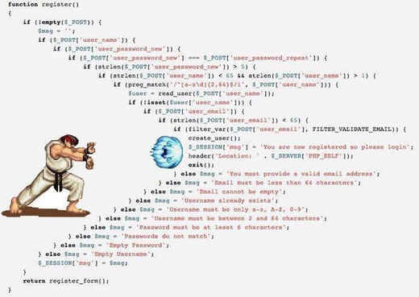

- title : PBT with F#
- description : Property Based Testing with F#
- author : Tomasz Heimowski
- theme : night
- transition : default

***

##Property based testing with F#

###Plan

1. Standard approach
2. Property based approach
3. Working example
4. How to come up with a good test
5. How we use it in Phoenix

Credits: http://fsharpforfunandprofit.com/

***

##Standard approach

###or "what's wrong with unit tests?"

---

##1. Correctness

--- 

*"Unit tests have been compared with shining a flashlight into a dark room in search of a monster. Shine the light into the room and then into all the scary corners. It doesn't mean the room is monster free - just that the monster isn't standing where you've shined your flashlight."*

---

    [<Fact>]
    let ``5 add 3 gives 8``() =
        let actual = add 5 3
        Assert.Equal(8, actual)

* How could add be implemented?

---

    [<Fact>]
    let ``isPalindrome returns true for "kajak"``() =
        let actual = isPalindrome "kajak"
        Assert.Equal(true, actual)

* How certain are we that the function is correctly implemented?
* How is null handled?
* How does it work for input with even count of letters?

---

*"Unit tests do not prove that a program runs correctly. 
Unit tests may at most tell that the program does not fail for specific cases."*

#### *"How many tests are enough?"*

---

##2. Arrange phase
####(also known as fixture)

---

    [<Fact>]
    let ``5 add 3 gives 8``() =
        // Arrange phase
        let x = 5
        let y = 3

        // Act phase
        let actual = add x y
        
        // Assert phase
        Assert.Equal(8, actual)

---

    [<Fact>]
    let ``customer is important if she has X subscriptions``() =
        // Arrange phase
        let inputXml = 
            """<customer>
                    <firstName>John</firstName>
                    <lastName>Doe</lastName>
                    <email>john.doe@example.com</com>
                    <subscriptions>
                        <subscription>
                            <type>...
                    ...
               </customer>
            """
        // Act phase
        let result = classifyCustomer inputXml

        // Assert phase
        Assert.True(result.IsImportantCustomer)

---

    [<Test>]
    let ``ignores disabled nuget feed from upstream`` () =
        // Arrange
        let upstream = 
            { NugetConfig.Empty with
                PackageSources = 
                    [ "MyGetDuality", ("https://www.myget.org/", None) ]
                    |> Map.ofList }
        let next = 
            // "Config.xml" is a file created for the arrange part
            NugetConfig.GetConfigNode (FileInfo "Config.xml") 
            |> Trial.returnOrFail
        
        // Act
        let overridden = NugetConfig.OverrideConfig upstream next

        // Assert
        overridden
        |> shouldEqual
            { PackageSources = 
                [ "nuget.org", ("https://www.nuget.org/api/v2/",None) ]
                |> Map.ofList
              PackageRestoreEnabled = true
              PackageRestoreAutomatic = true }

---

##Issues with standard approach
###(unit tests)

1. **Correctness** is not guaranteed
2. **Arrange** phase can be overwhelming

***

##Property based approach

---

##Idea

* Don't test for specific cases
* Think about what **properties** your code should have
* Test input / fixture is ambiguous - it's generated for a certain **type**
* We manipulate the generator, and the library makes sure to provide arbitrary instances

http://fsharpforfunandprofit.com/posts/property-based-testing/

---

##Building blocks

1. Generator
2. Shrinker

---

##Generator

* Library comes with predefined generators for primitive types and most basic language structures
* The mechanism is extensible, i.e. we can create our own generators for certain cases
* Given a generator and a seed, the library generates random instances of the desired type
* A single test is repeated multiple times, each time with a slightly "bigger" input

---

##Shrinker

* If for some input a test fails, the input is being shrunk
* If the shrunk input still causes the test to fail, it's being shrunk again
* Process is repeated until minimal faulty input is found

---

##Property based approach
###solving issues with unit tests

1. Arbitrary input can detect edge cases - **Correctness**
2. Much simpler and consistent "Arrange phase" - **Arrange**

***

##Working example

###(a journey to Nirvana)

---

###Revisited add - initial version

    [<Fact>]
    let ``5 add 3 gives 8``() =
        let actual = add 5 3
        Assert.Equal(8, actual)

---

###Add - parametrized tests

    [<Theory>]
    [<InlineData(5, 3, 8)>]
    [<InlineData(2, 2, 4)>]
    [<InlineData(-4, 9, 5)>]
    let ``add gives sum of two components``(x, y, expected) =
        let actual = add x y
        Assert.Equal(expected, actual)

---

###Add - using AutoFixture library

    [<Theory>]
    [<AutoData>]
    let ``add gives sum of two components``(x, y) =
        let expected = x + y
        let actual = add x y
        Assert.Equal(expected, actual)

* run only once?
* what about using the "+" operator?

---

###Add - using Property Based Approach

' 1. order doesn't matter - commutative property - przemienność
' 2. adding 0 to anything always gives the latter - identity property - element zerowy?
' 3. x + (y + z) = (x + y) + z - associative property - łączność

####Demo

***

##How to come up with a good test

---

##Scott Wlaschin's list

1. "Different paths, same destination"
2. **"There and back again"**
3. "Some things never change"
4. **"The more things change, the more they stay the same"**
5. "Solve a smaller problem first"
6. "Hard to prove, easy to verify"
7. **"The test oracle"**

http://fsharpforfunandprofit.com/posts/property-based-testing-2/

---

## "There and back again"

    [<Property>]
    let ``parsing a stringified JSON gives original result`` (original: JSON) =
        let stringified = stringify original
        let parsed = parse stringified
        parsed = original

---

## "The more things change, the more they stay the same"

    [<Property>]
    let ``distinct is idemptotent`` (input: list<'a>) =
        let firstTurn = distinct input
        let secondTurn = distinct firstTurn
        firstTurn = secondTurn

---

## "The test oracle"
    
    [<Property>]
    let ``optimised version really works`` (input) =
        let optimisedResult = hiperFastConcurrentAlgorithm input
        let plainResult = simpleButSlowerAlgorithm input
        plainResult = optimisedResult

***

##How we use it in Phoenix

---

##Desktop publishing

---

##Quark XPress

---

##Adobe InDesign

---

##Quark Stack

* Quark Publishing Platform
* Quark XML Author
* Quark XPress + Quark XPress **Server**

---

##Quark XPress Server

###Quark XPress template + Modifier XML = PDF

---

##Desktop publishing

---

##Desktop publishing automation

---

##Modifier XML

    [lang=xml]
    <LAYOUT>
        <PAGESEQUENCE MASTERREFERENCE="Main">
            <STORY>
                <PARAGRAPH PARASTYLE="m_header_1">
                    <RICHTEXT>My first publication</RICHTEXT>
                </PARAGRAPH>
                <PARAGRAPH PARASTYLE="m_body">
                    <RICHTEXT>Hello </RICHTEXT>
                    <RICHTEXT BOLD="TRUE">world!</RICHTEXT>
                </PARAGRAPH>
            </STORY>
        </PAGESEQUENCE>
    </LAYOUT>

---

##Dita XML
####(or rather Phoenix-Dita XML)

    [lang=xml]
    <topic>
        <title>My first publication</title>
        <body>
            
Hello <b>world!</b>

        </body>
    </topic>

---

##XSLT !!!

--- 

##XSLT can get as complex ...

---

##... as JavaScript ...

---

###... so it's good to have some tests

---

##Generator

    let title = gen {
        let! contents = contents
        return XElement("title", contents)
    }

    let body = gen {
        let! items = Gen.oneOf [ para; table; chart ] |> Gen.listOf
        return XElement("body", items)
    }

    let topic = gen {
        let! title = title
        let! body = body
        return XElement("topic", title, body)
    }

---

##Tests

    let schema = XmlSchema.Parse "Modifier.xsd"

    [<Property>]
    let ``modifier XML conforms to schema`` (topic: XDocument) =
        let output = xsltTransform "topic.xslt" topic
        doesNotThrow (fun () -> schema.Validate output)

* alternative -> schema-aware XSLT processor 

---

##Moar tests

    [<Property>]
    let ``if text node under "b" element then richtext has bold`` (topic) =
        let output = xsltTransform "topic.xslt" topic
        let textNodes = topic  |> xpath "//text()"
        let richtexts = output |> xpath "//RICHTEXT"
        
        (textNodes, richtexts)
        ||> Seq.zip
        |> Seq.filter (fst >> xpath "ancestor::b")
        |> Seq.forAll (snd >> xpath "@BOLD = 'TRUE'")

---

##Shrinker

    [lang=xml]
    <topic>
        <title>My first publication</title>
        <body>
            <image href="unicorn.pdf">
            
Hello <b>world!</b>

            <table>
                <title>table</title>
                <tbody>
                    <row>
                        <entry>aaa</entry>
                    </row>
                </tbody>
            </table>
        </body>
    </topic>

####Original input

---

##Shrinker

    [lang=xml]
    <topic>
        <title/>
        <body>
            
<b>w</b>

        </body>
    </topic>

####Shrinked input

---

##Using Property Based Testing for testing XSLT
###Conclusions so far

* (+) Automatic detection of edge cases
* (+) Easier to maintain "Arrange" phase - everything is in Generator
* (+) All tests rely on the same Generator - improves consistency
* (+) Easy to find minimal faulty input thanks to Shrinker
* (-) "Assert" phase is slightly more complex
* (-) Error reasoning can sometimes get tricky

---

##Questions?

***